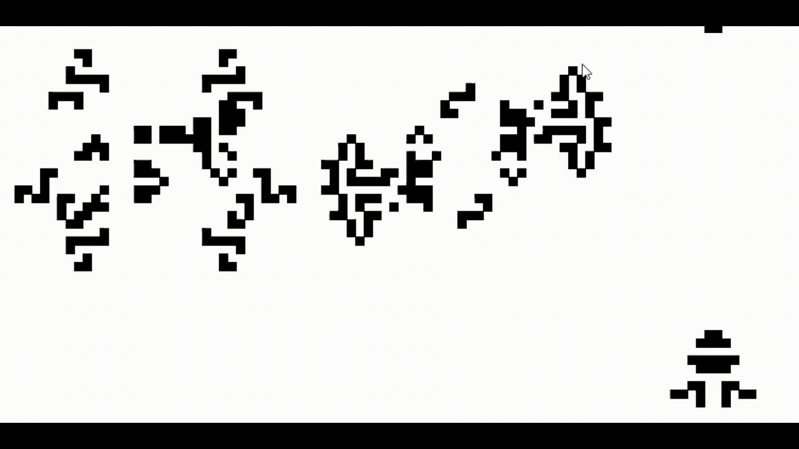

# Conway's Game of Life in Excel

## Overview
This is an implementation of [Conway's Game of Life](https://en.wikipedia.org/wiki/Conway%27s_Game_of_Life) in Microsoft Excel. The Game of Life is a cellular automaton, a mathematical model that simulates the evolution of a population over time based on a set of simple rules.

## Demo

## How to Use
1. Open the Excel file containing the Game of Life simulation.
2. Enable macros if prompted by Excel. This is necessary for the simulation to run correctly.
3. Navigate to the "Config" sheet.
4. Adjust the grid size by modifying the "Rows" and "Cols" values (up to 256x256).
5. Customize the initial pattern on the "Initial Layout" sheet by setting cell values to 1 (live) or 0 (dead).
6. Click the "Reset" button on the Controls sheet.
7. Click the "Calculate Now" button to start the simulation.
8. Observe the pattern evolution on the "grid" sheet.

## Workbook Structure
- *Controls*: Allows you to set the grid size and reset/start/stop the simulation.
- *Log*: Tracks the total number of live cells for each iteration.
- *Initial Grid*: Enables you to define the starting pattern.
- *Grid*: Displays the current state of the game grid.

## Technical Details
- The workbook uses advanced Excel features like dynamic arrays, LAMBDA functions, and VBA macros to implement the simulation.
- Key Excel functions used:
  - LET, LAMBDA, SEQUENCE, INDEX, MOD, VSTACK, OFFSET
- The workbook is compatible with Excel versions that support the required functions.

## Limitations
- Performance may degrade for very large grid sizes (>256x256) due to the complexity of the calculations.